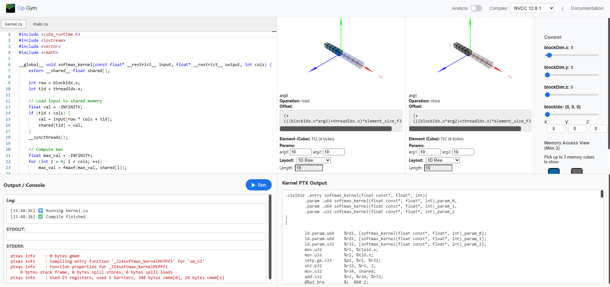

# Op Gym

An interactive playground to **visualize and learn GPU memory access patterns** for CUDA / Triton kernels.




Programming for accelerators like GPUs is essential for developing high-performance neural network operators. While CUDA provides fine-grained control over memory management and parallelism, it can be challenging to visualize and understand how threads access memory during execution.

Op-Gym is an interactive learning platform featuring a visual interface for writing CUDA and Triton operator kernels, compiling them into PTX, analyzing memory instructions, and intuitively demonstrating how threadIdx and blockIdx interact with memory buffers.


---

## What You Can Do 
* Compile with cloud NVCC (via [Godbolt](https://godbolt.org/))
* Parse `ld.global` and `st.global` instructions from PTX
* Visualize memory access patterns across multiple buffers
* Tweak `blockDim`, `blockIdx`, and memory layouts in real time
* See memory as a **3D cube** with thread-level access highlights
* Explore 1D, 2D (row/col-major), and 3D memory layouts

---

## Features 

* ✍️ Interactive CUDA code editing online
* 🔍 PTX memory analyzer (for loads and stores)
* 📦 Memory layout + thread/block visualization


---

## Roadmap 

* [ ] Triton kernel editor and visualization
* [ ] LLM-assisted code tips and autocompletion
* [ ] Automatic input shape parsing from `main.cu`
* [ ] Local compiler backend (offline NVCC)

---

## Quickstart 

### 🔙 Backend (FastAPI)

```bash
cd backend
pip install -r requirements.txt
uvicorn main:app --reload --port 8000
```

Visit API docs at [http://localhost:8000/docs](http://localhost:8000/docs)

---

### 🔜 Frontend (React + Vite)

```bash
cd frontend
npm install
npm run dev
```

Open in browser: [http://localhost:5173](http://localhost:5173)
